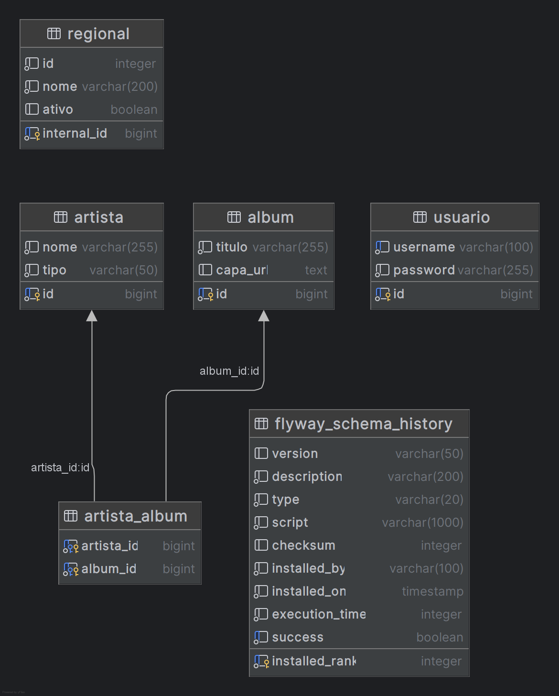

# Seplag Album API

API REST para gerenciamento de artistas e álbuns, desenvolvida com Java 25 e Spring Boot 4.0.2. A aplicação inclui funcionalidades de autenticação JWT, armazenamento de imagens no MinIO, notificações via WebSocket, rate limit e sincronização de dados externos.

## 🚀 Tecnologias Utilizadas

- **Java 25**
- **Spring Boot 4.0.2**
- **Spring Security** (Autenticação JWT)
- **Spring Data JPA** (PostgreSQL)
- **Flyway** (Migrações de banco de dados)
- **MinIO** (Armazenamento de capas de álbuns)
- **Bucket4j** (Rate limit: 10 req/min)
- **Springdoc OpenAPI/Swagger** (Documentação)
- **Spring WebSocket** (Notificações em tempo real)
- **Spring HATEOAS** (Hypermedia / Richardson Maturity Model Level 3)
- **Spring Actuator** (Health Checks)

## 🏗️ Arquitetura do Projeto

O projeto segue o padrão de camadas clássico do Spring Boot:

1.  **Controller**: Camada de entrada que expõe os endpoints REST e lida com as requisições HTTP.
2.  **Service**: Contém a lógica de negócio da aplicação.
3.  **Repository**: Interface de comunicação com o banco de dados PostgreSQL via Spring Data JPA.
4.  **Model/Entity**: Representação das tabelas do banco de dados.
5.  **DTO**: Objetos de transferência de dados para requisições (Request) e respostas (Response).
6.  **Mapper**: Classes responsáveis pela conversão entre entidades e DTOs.
7.  **Exception**: Tratamento centralizado de exceções com respostas padronizadas.
8.  **Security**: Configurações de segurança, filtros JWT e provedores de autenticação.
9.  **Config**: Configurações gerais (CORS, MinIO, OpenAPI, WebSocket).

### 📊 Diagrama Entidade-Relacionamento (DER)

O diagrama abaixo ilustra a modelagem do banco de dados da aplicação:



O banco de dados é composto por 4 entidades principais:

- **Artista**: Armazena os artistas com `id`, `nome` e `tipo` (CANTOR ou BANDA).
- **Album**: Armazena os álbuns com `id`, `titulo` e `capa_url` (referência à imagem no MinIO).
- **artista_album**: Tabela associativa que implementa o relacionamento N:N entre Artista e Album, contendo as chaves estrangeiras `artista_id` e `album_id`.
- **Usuario**: Armazena as credenciais de autenticação com `id`, `username` (único) e `password`.
- **Regional**: Armazena as regionais sincronizadas do integrador externo com `internal_id`, `id` (ID do integrador), `nome` e `ativo`.

### Relacionamentos
- **Artista <-> Álbum**: Relacionamento N:N (Muitos para Muitos) através da tabela associativa `artista_album`.
- **Otimização N+1**: Uso de `@EntityGraph` no repositório de álbuns para carregar artistas em uma única query.

### DTOs e Mappers
- **Request DTOs**: `ArtistaRequest`, `AlbumRequest` - Recebem dados nas requisições POST/PUT.
- **Response DTOs**: `ArtistaResponse`, `AlbumResponse`, `RegionalResponse` - Retornam dados nas respostas.
- **Mappers**: `ArtistaMapper`, `AlbumMapper` - Convertem entre entidades e DTOs usando **MapStruct**, separando a camada de apresentação da camada de domínio.

### Validações e Tratamento de Erros
- **Bean Validation**: Validações automáticas nos DTOs usando anotações `@NotBlank`, `@NotNull`, `@Size`.
- **Mensagens Internacionalizadas**: Mensagens de validação centralizadas no arquivo `messages.properties` com suporte UTF-8.
- **GlobalExceptionHandler**: Tratamento centralizado de exceções com respostas padronizadas:
  - **404 Not Found**: Recurso não encontrado
  - **400 Bad Request**: Erros de validação
  - **401 Unauthorized**: Falha na autenticação
  - **500 Internal Server Error**: Erros genéricos

## 🛠️ Como Executar

### Pré-requisitos
- Docker e Docker Compose instalados.
- Maven (opcional, se quiser rodar localmente fora do container).

### Passo a Passo

1.  **Configurar Variáveis de Ambiente:**
    Verifique o arquivo `.env` na raiz do projeto e ajuste as credenciais se necessário.

2.  **Subir a infraestrutura e a aplicação via Docker:**
    ```bash
    docker-compose up -d --build
    ```
    Isso iniciará o **PostgreSQL**, o **MinIO** e a **própria aplicação** (porta 8080).
    *Nota: O Dockerfile utiliza a imagem `eclipse-temurin:25-jdk-noble` para suportar o Java 25.*

3.  **Executar localmente (Opcional):**
    Se preferir rodar apenas o banco e storage no Docker e a app localmente:
    ```bash
    # Sobe apenas dependências
    docker-compose up -d postgres minio
    
    # Roda a aplicação
    mvn spring-boot:run
    ```

4.  **Acessar a documentação:**
    A documentação interativa (Swagger UI) estará disponível em:
    `http://localhost:8080/swagger-ui.html`

## 🔐 Autenticação

A maioria dos endpoints requer um token JWT no cabeçalho `Authorization`.

### Login
- **URL:** `/api/v1/auth/authenticate`
- **Método:** `POST`
- **Exemplo de Body:**
  ```json
  {
    "username": "admin",
    "password": "password"
  }
  ```
- **Resposta:** Um token JWT válido por 5 minutos.

### Refresh Token
- **URL:** `/api/v1/auth/refresh-token`
- **Método:** `POST`
- **Descrição:** Gera um novo token a partir de um token ainda válido.

## 📁 Endpoints Principais

### Artistas
- `GET /api/v1/artistas?nome=Mike&ordem=desc`: Lista artistas com filtro e ordenação alfabética.
- `GET /api/v1/artistas/{id}`: Busca um artista por ID.
- `POST /api/v1/artistas`: Cadastra um novo artista.
- `PUT /api/v1/artistas/{id}`: Atualiza um artista existente.

### Álbuns
- `GET /api/v1/albuns?tipo=CANTOR&page=0&size=10`: Lista álbuns com paginação e filtro por tipo (CANTOR/BANDA).
- `GET /api/v1/albuns/{id}`: Busca um álbum por ID.
- `POST /api/v1/albuns`: Cadastra um novo álbum.
- `PUT /api/v1/albuns/{id}`: Atualiza um álbum.
- `POST /api/v1/albuns/{id}/capa`: Upload de imagem de capa (Multipart).

### Regionais
- `GET /api/v1/regionais?apenasAtivas=true`: Lista as regionais importadas do integrador externo.
- `GET /api/v1/regionais/{internalId}`: Busca uma regional por ID interno.

## 🔗 HATEOAS (Richardson Maturity Model - Level 3)

A API implementa o nível 3 do Modelo de Maturidade de Richardson utilizando **Spring HATEOAS**, onde cada resposta inclui links hipermídia que permitem ao cliente navegar pela API de forma dinâmica, sem precisar conhecer as URLs previamente.

Os DTOs de resposta (`ArtistaResponse`, `AlbumResponse` e `RegionalResponse`) estendem `RepresentationModel`, permitindo a adição de links HAL.

### Links por Recurso

**Artista:**
- `self`: Link para o próprio artista (`GET /api/v1/artistas/{id}`)
- `artistas`: Link para a listagem de artistas (`GET /api/v1/artistas`)

**Álbum:**
- `self`: Link para o próprio álbum (`GET /api/v1/albuns/{id}`)
- `albuns`: Link para a listagem de álbuns (`GET /api/v1/albuns`)
- `upload-capa`: Link para upload da capa (`POST /api/v1/albuns/{id}/capa`)

**Regional:**
- `self`: Link para a própria regional (`GET /api/v1/regionais/{internalId}`)
- `regionais`: Link para a listagem de regionais (`GET /api/v1/regionais`)

### Exemplo de Resposta (Artista)
```json
{
  "id": 1,
  "nome": "Linkin Park",
  "tipo": "BANDA",
  "_links": {
    "self": { "href": "http://localhost:8080/api/v1/artistas/1" },
    "artistas": { "href": "http://localhost:8080/api/v1/artistas?ordem=asc" }
  }
}
```

### Exemplo de Resposta (Regional)
```json
{
  "internalId": 1,
  "id": 10,
  "nome": "Regional Norte",
  "ativo": true,
  "_links": {
    "self": { "href": "http://localhost:8080/api/v1/regionais/1" },
    "regionais": { "href": "http://localhost:8080/api/v1/regionais?apenasAtivas=false" }
  }
}
```

### Exemplo de Resposta (Álbum - Paginado)
```json
{
  "_embedded": {
    "albumResponseList": [
      {
        "id": 1,
        "titulo": "Hybrid Theory",
        "capaUrl": "https://minio/...",
        "artistas": [{ "id": 1, "nome": "Linkin Park", "tipo": "BANDA" }],
        "_links": {
          "self": { "href": "http://localhost:8080/api/v1/albuns/1" },
          "albuns": { "href": "http://localhost:8080/api/v1/albuns?page=0&size=10" },
          "upload-capa": { "href": "http://localhost:8080/api/v1/albuns/1/capa" }
        }
      }
    ]
  },
  "_links": {
    "self": { "href": "http://localhost:8080/api/v1/albuns?page=0&size=10" },
    "next": { "href": "http://localhost:8080/api/v1/albuns?page=1&size=10" }
  },
  "page": {
    "size": 10,
    "totalElements": 15,
    "totalPages": 2,
    "number": 0
  }
}
```

### Respostas HTTP Semânticas
- **POST** retorna `201 Created` com header `Location` apontando para o recurso criado.
- **GET** e **PUT** retornam `200 OK`.
- Listagem de álbuns utiliza `PagedModel` com metadados de paginação e links `next`/`prev`.
- Listagem de artistas e regionais utiliza `CollectionModel`.

## 🌟 Funcionalidades Especiais

### Armazenamento de Imagens (MinIO)
As capas dos álbuns são enviadas para o bucket `albuns` no MinIO. O bucket é criado automaticamente na inicialização da aplicação. Ao listar os álbuns, a API gera automaticamente **links pré-assinados** com expiração de 30 minutos para visualização segura.

### WebSocket
A aplicação notifica todos os clientes conectados ao tópico `/topic/albuns` sempre que um novo álbum é cadastrado (apenas POST, não em atualizações). A notificação é enviada somente após o commit da transação, garantindo consistência entre o banco de dados e os clientes WebSocket.
- **Endpoint:** `/ws` (com suporte a SockJS)
- **Tópico:** `/topic/albuns`

#### Exemplo de uso no Front-End

**JavaScript (com SockJS e STOMP):**
```javascript
// Instalar: npm install sockjs-client @stomp/stompjs
import SockJS from 'sockjs-client';
import { Client } from '@stomp/stompjs';

const client = new Client({
  webSocketFactory: () => new SockJS('http://localhost:8080/ws'),
  onConnect: () => {
    console.log('Conectado ao WebSocket');
    client.subscribe('/topic/albuns', (message) => {
      const novoAlbum = JSON.parse(message.body);
      console.log('Novo álbum cadastrado:', novoAlbum);
      // Atualizar UI com o novo álbum
    });
  },
  onStompError: (frame) => {
    console.error('Erro STOMP:', frame);
  }
});

client.activate();
```

**React (com hooks):**
```javascript
import { useEffect, useState } from 'react';
import SockJS from 'sockjs-client';
import { Client } from '@stomp/stompjs';

function AlbumNotifications() {
  const [albuns, setAlbuns] = useState([]);

  useEffect(() => {
    const client = new Client({
      webSocketFactory: () => new SockJS('http://localhost:8080/ws'),
      onConnect: () => {
        client.subscribe('/topic/albuns', (message) => {
          const novoAlbum = JSON.parse(message.body);
          setAlbuns(prev => [...prev, novoAlbum]);
        });
      }
    });

    client.activate();
    return () => client.deactivate();
  }, []);

  return (
    <div>
      {albuns.map(album => (
        <div key={album.id}>{album.titulo}</div>
      ))}
    </div>
  );
}
```

### Sincronização de Regionais
Um serviço agendado (`@Scheduled`) consome `https://integrador-argus-api.geia.vip/v1/regionais` a cada hora e sincroniza os dados:
- Insere novas regionais.
- Inativa regionais ausentes no endpoint.
- Se um nome mudar, inativa o registro antigo e cria um novo (conforme requisito).

### Rate Limit
Configurado para permitir até 10 requisições por minuto por usuário. Caso excedido, retorna HTTP 429.

### Health Checks
- `GET /actuator/health/liveness`
- `GET /actuator/health/readiness`
